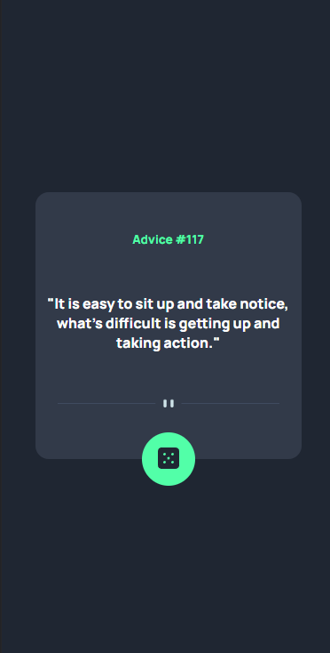
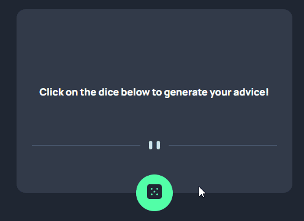

### 
Choose your language | Escolha seu idioma 

 

 

 

  

<h3 align="center">Random Advice Generator</h3>

  

    A component that generates random advice through an API
  

  
  <a href="https://edilan-ribeiro.github.io/advice-generator/">View Demo</a>

 

  
Table of Contents

  <ol>
    <li>
      <a href="#about-the-project">About The Project</a>
      <ul>
        <li><a href="#built-with">Built With</a></li>
        <li><a href="#highlights">Highlights</a></li>
        <li><a href="#challenges-and-lessons-learned">Challenges and lessons learned</a></li>
      </ul>
    </li>
    <li><a href="#contact">Contact</a></li>
  </ol>

  

## About The Project

 

Here when the API is called, by clicking the dice, a random advice will be generated in the page.  
An API, or Application Programming Interface, is a set of rules and protocols that enables different software to communicate and interact with each other efficiently. They are essential for the development of modern applications, especially when it comes to creating complex and scalable services.

 
<strong>Mobile</strong>:

 

Running:
  

(<a href="#readme-top">back to top</a>)

### Built With

(<a href="#readme-top">back to top</a>)

## Highlights

 

This page was based on the frontendmentor challenge 
<a href="https://www.frontendmentor.io/challenges/advice-generator-app-QdUG-13db" target="_blank"> you can check out the challenge here.</a>

 

The highlights of this component include:
- Use of API
- Responsive layout

Extras added beyond the challenge:
- Usage instructions upon initiation
- Die spins while fetching the API

(<a href="#readme-top">back to top</a>)

## Challenges and lessons learned

👨‍💻 The use of APIs was an excellent addition to my skills. Imagine creating advice by advice – without the application of APIs, I might have even advised myself not to create an advice page 😵.

👨‍🔧 Attention to detail is key. Even for a small component, lack of attention to details could result in a huge headache when it comes to element positioning.

🚀 Going above and beyond, the challenge was already completed, but couldn't it be made even more visually appealing? It took very little effort to add usage instructions and a page animation, and it was worth it – the clarity of the page's activity improved significantly.

In summary, I was able to learn:
- Use of APIs
- Positioning and division of responsibilities
- Code improvement for better user experience

## Contact

💌 To send me a message, just use one of the buttons below! 

  
   
  

(<a href="#readme-top">back to top</a>)

