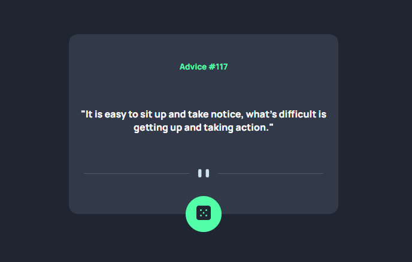
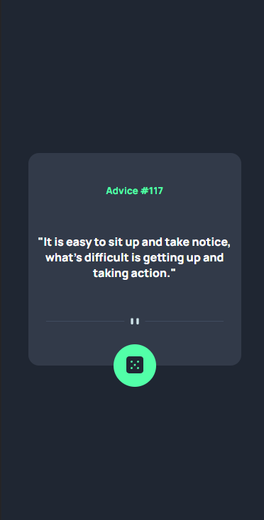
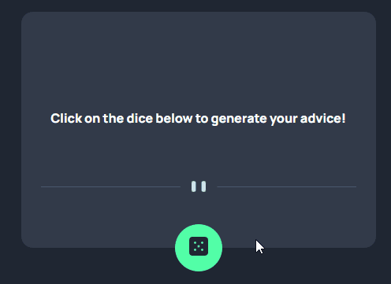

### 
Escolha seu idioma | Choose your language 

 

 

 

  

<h3 align="center">Random Advice Generator</h3>

  

    Um componente que produz conselhos aleatórios através de uma API
  

  
  <a href="https://edilan-ribeiro.github.io/advice-generator/">Clique aqui para abrir o projeto online</a>

 

  
Índice

  <ol>
    <li>
      <a href="#sobre-o-projeto">Sobre o projeto</a>
      <ul>
        <li><a href="#feito-com">Feito com</a></li>
        <li><a href="#notas-de-destaque">Notas de destaque</a></li>
        <li><a href="#desafios-e-aprendizados">Desafios e aprendizados</a></li>
        </ul>
    </li>
    <li><a href="#contato">Contato</a></li>
  </ol>

  

## Sobre o projeto

 

Quando a API for chamada, ao clicar no dado, um conselho aleatório será gerado na página. 
Uma API, ou Interface de Programação de Aplicativos, é um conjunto de regras e protocolos que permite que diferentes softwares se comuniquem e interajam entre si de maneira eficiente. Elas são essenciais para o desenvolvimento de aplicativos modernos, especialmente quando se trata de criar serviços complexos e escaláveis.

 
<strong>Como ficou no mobile</strong>:

 

Em funcionamento:
  

(<a href="#readme-top">back to top</a>)

### Feito com

(<a href="#readme-top">back to top</a>)

 

## Notas de destaque

 

Esta página foi baseada no desafio do frontendmentor 
<a href="https://www.frontendmentor.io/challenges/advice-generator-app-QdUG-13db" target="_blank"> você pode conferir a proposta do desafio aqui </a>

Destaques deste componente:
- Utilização de API
- Layout responsivo

Extras adicionados além do desafio:
- Adicionado instrução de uso ao iniciar
- Dado gira enquanto busca acessa a API

 

(<a href="#readme-top">back to top</a>)

## Desafios e aprendizados

👨‍💻 Uso de APIs foi uma excelente adição as minhas habilidades, imagina criar conselho por conselho, sem a aplicação de API talvez eu até me aconselhasse a não criar uma página de conselhos 😵

👨‍🔧 Atenção aos detalhes, mesmo sendo um componente pequeno a falta se atenção a detalhes pode levar a uma dor de cabeça enorme na hora de posicionar os elementos.

🚀 Indo além, o desafio estava concluído mas podia ficar mais bonito né? Custou muito pouco adicionar instruções de uso e uma animação na página e valeu a pena, a clareza de atividade da página melhorou muito.

Em resumo foi possível aprender:
 - Utilização de APIs
 - Posicionamento e divisão de responsabilidades
 - Aprimoramento de código para melhor utilização por parte do usuário

 
(<a href="#readme-top">back to top</a>)

## Contato

💌 Para me mandar uma mensagem basta usar um dos botões abaixo! 

  
   
  

(<a href="#readme-top">back to top</a>)
